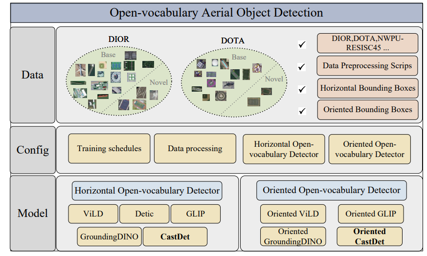
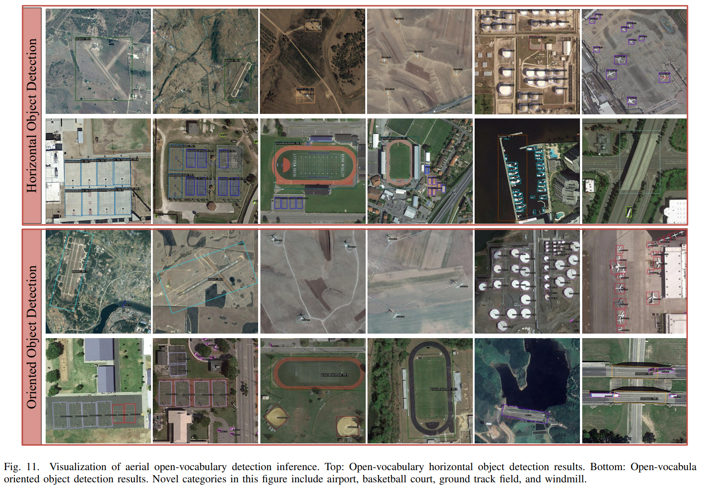
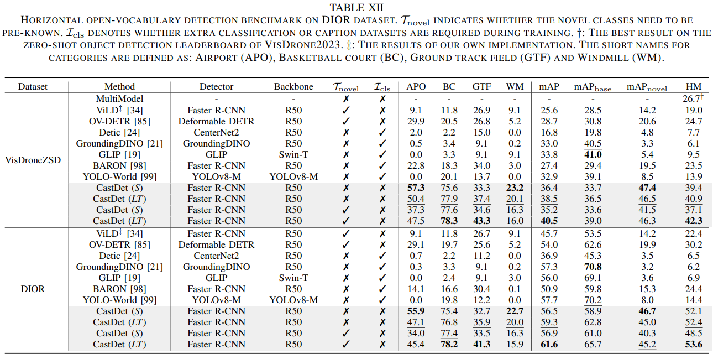
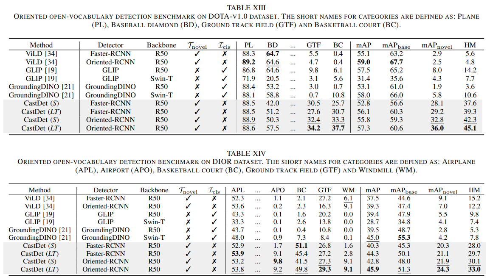

# [ECCV 2024] Toward Open Vocabulary Aerial Object Detection with CLIP-Activated Student-Teacher Learning


> **Note**: This branch is for oriented open-vocabulary aerial object detection. **Please switch to another branch for horizontal detection.**

## ✨ Latest Updates


📆 [**2025-02-08**] : The code for **Oriented CastDet** is now available! 🎉 CastDet now supports Open-vocabulary Oriented Aerial Object Detection. Stay tuned—**Oriented GLIP**, **Oriented GroundingDINO**, and **Oriented ViLD** are coming soon! 🚀

📆 [**2024-11-04**] : Our paper ["Exploiting Unlabeled Data with Multiple Expert Teachers for Open Vocabulary Aerial Object Detection and Its Orientation Adaptation"](https://arxiv.org/abs/2411.02057) is available open on arxiv!

📆 [**2024-07-01**] : Our paper ["Toward Open Vocabulary Aerial Object Detection with CLIP-Activated Student-Teacher Learning"](https://arxiv.org/abs/2311.11646) has been accepted by ECCV 2024!

📆 [**2024-04-21**] : We've released the code of **CastDet** now.


## Introduction

In recent years, aerial object detection has been increasingly pivotal in various earth observation applications. However, current algorithms are limited to detecting pre-annotated categories. In this paper, we put forth a novel formulation of the aerial object detection problem, namely open-vocabulary aerial object detection (OVAD), which can detect objects beyond training categories without costly collecting new labeled data. We propose CastDet, a CLIP-activated student-teacher detection framework that serves as the first OVAD detector specifically designed for the challenging aerial scenario, where objects exhibit weak appearance features and arbitrary orientations. Our framework integrates a robust localization teacher along with several box selection strategies to generate high-quality proposals for novel objects. Additionally, the RemoteCLIP model is adopted as an omniscient teacher, which provides rich knowledge to enhance classification capabilities for novel categories. A dynamic label queue is devised to maintain high-quality pseudo-labels during training. By doing so, the proposed CastDet boosts not only novel object proposals but also classification. Furthermore, we extend our approach from horizontal to oriented OVAD with tailored algorithm designs for bounding box representation and pseudo-label generation. 

Moreover, we integrate multiple open-vocabulary oriented detection algorithms into this repo, including Oriented CastDet, Oriented ViLD, Oriented GLIP and Oriented GroundingDINO; and build a more comprehensive benchmark for the open-vocabulary aerial detection task, including both horizontal object detection and oriented object detection.

<div align="center">
  
</div>


## Installation

```shell
conda create --name castdet python=3.8 -y
conda activate castdet
conda install pytorch torchvision -c pytorch

# Install MMEngine and MMCV using MIM.
pip install -U openmim
mim install mmengine
mim install mmcv-full
mim install mmdet==3.3.0

cd mmrotate
pip install -r requirements/build.txt
pip install -v -e .

# Install other packages
pip install imagesize
pip install open_clip_torch
pip install future tensorboard
```

To use the Oriented GLIP or Oriented GroundingDINO, you need to install additional dependency packages:
```shell
# source installation
pip install -r requirements/multimodal.txt

# or mim installation
mim install mmdet[multimodal]
```

## Supported algorithms

Please refer to [castdet_readme](./projects/CastDetv2/README.md) to prepare the data, and other tutorials to train the model:

1. Horizontal Open-vocabulary Aerial Object Detection
- [x] CastDet (ECCV'24)

2. Oriented Open-vocabulary Aerial Object Detection
- [x] [Oriented CastDet](./projects/CastDetv2/README.md)
- [x] [Oriented GroundingDINO](./projects/GroundingDINO/README.md)
- [x] [Oriented GLIP](./projects/GLIP/README.md)
- [x] [Oriented ViLD](./projects/ViLD/README.md)


## Main results








## Acknowledgement

Thanks the wonderful open source projects [MMDetection](https://github.com/open-mmlab/mmdetection), [MMRotate](https://github.com/open-mmlab/mmrotate), [RemoteCLIP](https://github.com/ChenDelong1999/RemoteCLIP), [RHINO](https://github.com/SIAnalytics/RHINO), [ViLD](https://github.com/tensorflow/tpu/tree/master/models/official/detection/projects/vild), [GroundingDINO](https://github.com/IDEA-Research/GroundingDINO), and [GLIP](https://github.com/microsoft/GLIP)!

## Citation

If you find this repo useful for your research, please use the following BibTeX entry.

```
@misc{li2024open,
      title={Toward Open Vocabulary Aerial Object Detection with CLIP-Activated Student-Teacher Learning}, 
      author={Yan Li and Weiwei Guo and Xue Yang and Ning Liao and Dunyun He and Jiaqi Zhou and Wenxian Yu},
      year={2024},
      eprint={2311.11646},
      archivePrefix={arXiv},
      primaryClass={cs.CV}
}

@misc{li2024exploitingunlabeleddatamultiple,
      title={Exploiting Unlabeled Data with Multiple Expert Teachers for Open Vocabulary Aerial Object Detection and Its Orientation Adaptation}, 
      author={Yan Li and Weiwei Guo and Xue Yang and Ning Liao and Shaofeng Zhang and Yi Yu and Wenxian Yu and Junchi Yan},
      year={2024},
      eprint={2411.02057},
      archivePrefix={arXiv},
      primaryClass={cs.CV},
      url={https://arxiv.org/abs/2411.02057}, 
}
```