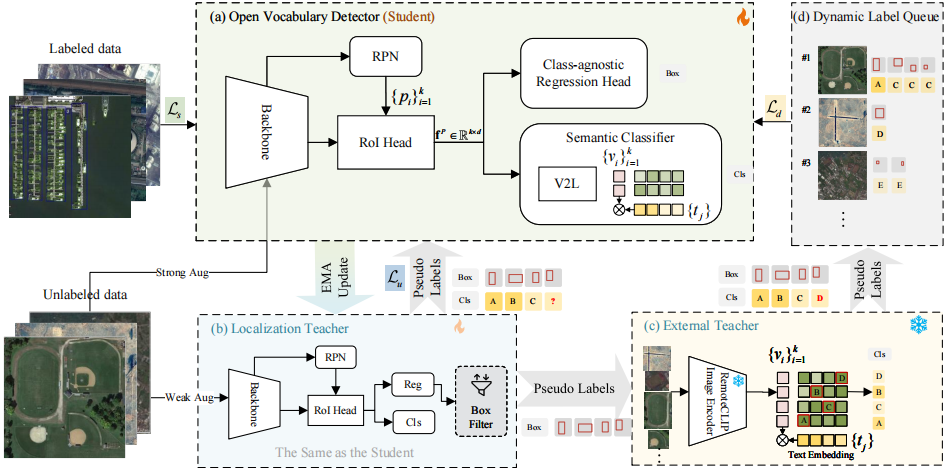
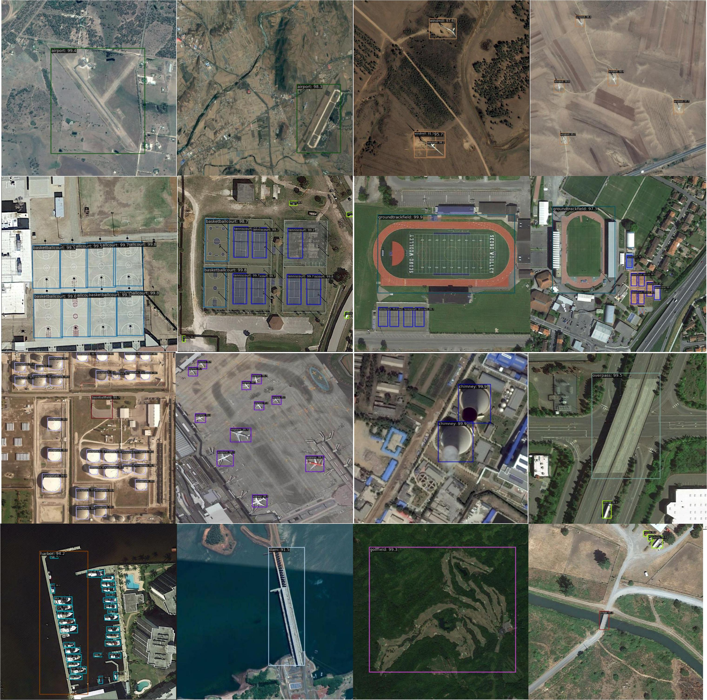

# [ECCV2024] Toward Open Vocabulary Aerial Object Detection with CLIP-Activated Student-Teacher Learning

[paper](https://arxiv.org/abs/2311.11646)

## Introduction

An increasingly massive number of remote-sensing images spurs the development of extensible object detectors that can detect objects beyond training categories without costly collecting new labeled data. In this paper, we aim to develop open-vocabulary object detection (OVD) technique in aerial images that scales up object vocabulary size beyond training data. The performance of OVD greatly relies on the quality of class-agnostic region proposals and pseudo-labels for novel object categories. To simultaneously generate high-quality proposals and pseudo-labels, we propose **CastDet**, a **C**LIP-**a**ctivated **s**tudent-**t**eacher open-vocabulary object **Det**ection framework.  Our end-to-end framework following the student-teacher self-learning mechanism employs the RemoteCLIP model as an extra omniscient teacher with rich knowledge. By doing so, our approach boosts not only novel object proposals but also classification. Furthermore, we devise a dynamic label queue strategy to maintain high-quality pseudo labels during batch training. We conduct extensive experiments on multiple existing aerial object detection datasets, which are set up for the OVD task. Experimental results demonstrate our CastDet achieving superior open-vocabulary detection performance, e.g., reaching 46.5% mAP  on VisDroneZSD novel categories, which outperforms the state-of-the-art open-vocabulary detectors by 21.0% mAP. To our best knowledge, this is the first work to apply and develop the open-vocabulary object detection technique for aerial images.

## Training framework

 

## Installation

```shell
conda create --name openmmlab python=3.8 -y
conda activate openmmlab
conda install pytorch torchvision -c pytorch

# Install MMEngine and MMCV using MIM.
pip install -U openmim
mim install mmengine
mim install "mmcv>=2.0.0"
mim install mmdet==3.3.0

# Install other packages
pip install imagesize
pip install open_clip_torch
```

Please refer to [MMDetection](https://github.com/open-mmlab/mmdetection) for more details.

## Preparing

### Dataset

1. [Download](https://opendatalab.com/OpenDataLab/DIOR/cli/main) Dataset

```shell
pip install openxlab #Install
pip install -U openxlab #Upgrade
openxlab login #Log in and enter the corresponding AK/SK
openxlab dataset info --dataset-repo OpenDataLab/DIOR #Dataset information viewing and View Dataset File List
openxlab dataset get --dataset-repo OpenDataLab/DIOR #Dataset download
openxlab dataset download --dataset-repo OpenDataLab/DIOR --source-path /README.md --target-path /path/to/local/folder #Dataset file download
```

2. Split Dataset

Following [VisDroneZSD Challenge2023](http://aiskyeye.com/submit-2023/zero-shot-object-detection/), we split the classes into 16 base classes and 4 novel classes, and the training set includes both labeled data (`visdrone_labeled_3000.txt`) and unlabeled data (`visdrone_unlabeled_8726.txt`). We put these files at `resources/visdronezsd_split`, please move them to `datasets/DIOR/ImageSets/Main` once you have downloaded the dataset.

We put all data into the `datasets` directory, such as:

```text
├── DIOR
    ├── Annotations
    ├── ImageSets
    |   ├── Main
    |   |   ├── visdrone_labeled_3000.txt
    |   |   ├── visdrone_unlabeled_8726.txt
    |   |   └── visdrone_test.txt
    |   └── ...
    ├── JPEGImages-test
    └── JPEGImages-trainval
```


### RemoteCLIP

- Download [RemoteCLIP](https://github.com/ChenDelong1999/RemoteCLIP) via huggingface_hub

```python
from huggingface_hub import hf_hub_download
checkpoint_path = hf_hub_download("chendelong/RemoteCLIP", f"RemoteCLIP-RN50.pt", cache_dir='checkpoints')
```

### Text Embeddings

We put the pre-computed CLIP embeddings for each category of VisDroneZSD in `resources/*.npy`, you can also choose to generate a new one for your custom dataset.

```shell
python tools/generate_text_embeddings.py \
        --save_path <save_path> \
        --model_path <clip model path> \
        --text_queries "dog" "cat" "car" \
        --add_bg [Optional]

# for example
python tools/generate_text_embeddings.py --save_path resources/remoteCLIP_embeddings_normalized.npy --model_path checkpoints/RemoteCLIP-RN50.pt --add_bg
```

## Training

```shell
## prepare the base model
python tools/train.py configs/visdrone_step1_base.py

## merge weights
python tools/merge_weights.py --clip_path <clip_path> --base_path <base_model_path> --save_path <save_init_model_path> --base_model <soft-teacher (default) | faster-rcnn>

### for example
python tools/merge_weights.py --clip_path checkpoints/RemoteCLIP-RN50.pt --base_path work_dirs/visdrone_step1_base/iter_80000.pth --save_path checkpoints/init_80k.pth --base_model soft-teacher

## self-training
python tools/train.py configs/visdrone_step2_castdet_12b_10k.py
```

## Evaluation
```shell
python tools/test.py <config_path> <ckpt_path>
```

## Inference

```shell
python tools/image_demo.py <img_path> <config_file> \
    --weights <ckpt_path> \
    --device cpu \
    --pred-score-thr <float>
```



## Acknowledgement

Thanks the wonderful open source projects [MMDetection](https://github.com/open-mmlab/mmdetection) and [RemoteCLIP](https://github.com/ChenDelong1999/RemoteCLIP)!

## Citation

If you find CastDet useful for your research, please use the following BibTeX entry.

```
@misc{li2024open,
      title={Toward Open Vocabulary Aerial Object Detection with CLIP-Activated Student-Teacher Learning}, 
      author={Yan Li and Weiwei Guo and Xue Yang and Ning Liao and Dunyun He and Jiaqi Zhou and Wenxian Yu},
      year={2024},
      eprint={2311.11646},
      archivePrefix={arXiv},
      primaryClass={cs.CV}
}


@misc{li2024exploitingunlabeleddatamultiple,
      title={Exploiting Unlabeled Data with Multiple Expert Teachers for Open Vocabulary Aerial Object Detection and Its Orientation Adaptation}, 
      author={Yan Li and Weiwei Guo and Xue Yang and Ning Liao and Shaofeng Zhang and Yi Yu and Wenxian Yu and Junchi Yan},
      year={2024},
      eprint={2411.02057},
      archivePrefix={arXiv},
      primaryClass={cs.CV},
      url={https://arxiv.org/abs/2411.02057}, 
}
```