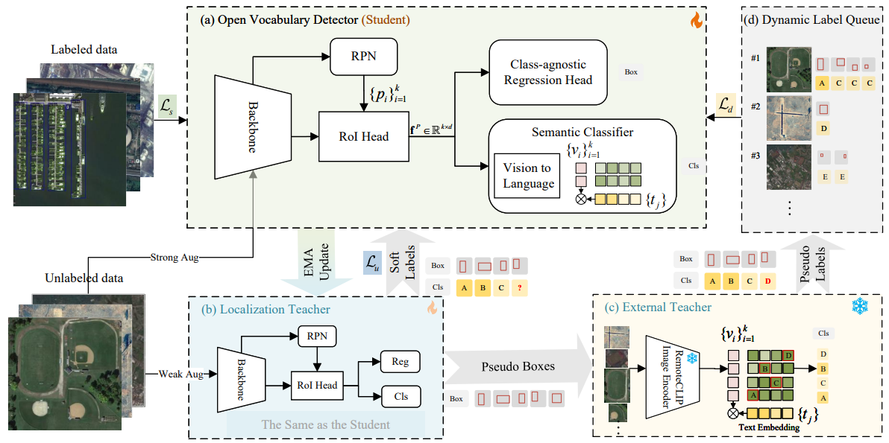

# Toward Open Vocabulary Aerial Object Detection with CLIP-Activated Student-Teacher Learning

[paper](https://arxiv.org/abs/2311.11646)

## Introduction

 An increasingly massive number of remote-sensing images spurs the development of extensible object detectors that can detect objects beyond training categories without costly collecting new labeled data. In this paper, we aim to develop open-vocabulary object detection (OVD) technique in aerial images that scales up object vocabulary size beyond training data. The fundamental challenges hinder open vocabulary object detection performance: the qualities of the class-agnostic region proposals and the pseudo-labels that can generalize well to novel object categories. To simultaneously generate high-quality proposals and pseudo-labels, we propose **CastDet**, a **C**LIP-**a**ctivated **s**tudent-**t**eacher open-vocabulary object **Det**ection framework.  Our end-to-end framework following the student-teacher self-learning mechanism employs the RemoteCLIP model as an extra omniscient teacher with rich knowledge. By doing so, our approach boosts not only novel object proposals but also classification. Furthermore, we devise a dynamic label queue strategy to maintain high-quality pseudo labels during batch training. We conduct extensive experiments on multiple existing aerial object detection datasets, which are set up for the OVD task. Experimental results demonstrate our CastDet achieving superior open-vocabulary detection performance, e.g., reaching 40.5\% mAP, which outperforms previous methods Detic/ViLD by 23.7\%/14.9\% on the VisDroneZSD dataset. To our best knowledge, this is the first work to apply and develop the open-vocabulary object detection technique for aerial images.

## Training framework
 

## Prerequisites

1. Installation: Please refer to [MMDetection](https://github.com/open-mmlab/mmdetection)
2. Download Datasets | [VisDroneZSD Challenge2023](http://aiskyeye.com/submit-2023/zero-shot-object-detection/)
3. Download [RemoteCLIP](https://github.com/ChenDelong1999/RemoteCLIP) via huggingface_hub
```
from huggingface_hub import hf_hub_download
checkpoint_path = hf_hub_download("chendelong/RemoteCLIP", f"RemoteCLIP-RN50.pt", cache_dir='checkpoints')
```


## Training

```python
## prepare the base model
python tools/train.py projects/CastDet/configs/visdrone_step1_base.py

## merge weights
python projects/CastDet/castdet/merge_weights.py --clip_path <clip_path> --base_path <base_model_path> --save_path <save_init_model_path> --base_model <soft-teacher (default) | faster-rcnn>

## training
python tools/train.py projects/CastDet/configs/visdrone_step2_castdet_16b_10k.py
```

## Inference

```python
python demo/image_demo.py <img_path> <config_file> \
    --weights <ckpt_path> \
    --device cpu \
    --pred-score-thr 0.3
```

## Acknowledgement

Thanks the wonderful open source projects [MMDetection](https://github.com/open-mmlab/mmdetection) and [RemoteCLIP](https://github.com/ChenDelong1999/RemoteCLIP)!

## Citation

If you find CastDet useful for your research, please use the following BibTeX entry.

```
@misc{li2024open,
      title={Toward Open Vocabulary Aerial Object Detection with CLIP-Activated Student-Teacher Learning}, 
      author={Yan Li and Weiwei Guo and Xue Yang and Ning Liao and Dunyun He and Jiaqi Zhou and Wenxian Yu},
      year={2024},
      eprint={2311.11646},
      archivePrefix={arXiv},
      primaryClass={cs.CV}
}
```