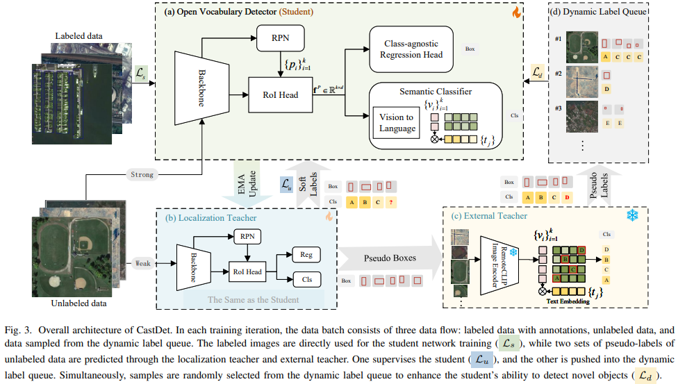

# [Oriented CastDet] Exploiting Unlabeled Data with Multiple Expert Teachers for Open Vocabulary Aerial Object Detection and Its Orientation Adaptation

[Toward Open Vocabulary Aerial Object Detection with CLIP-Activated Student-Teacher Learning](https://arxiv.org/abs/2311.11646)

[Exploiting Unlabeled Data with Multiple Expert Teachers for Open Vocabulary Aerial Object Detection and Its Orientation Adaptation](https://arxiv.org/abs/2411.02057)


## Introduction

In recent years, aerial object detection has been increasingly pivotal in various earth observation applications. However, current algorithms are limited to detecting a set of pre-defined object categories, demanding sufficient annotated training samples, and fail to detect novel object categories. In this paper, we put forth a novel formulation of the aerial object detection problem, namely open-vocabulary aerial object detection (OVAD), which can detect objects beyond training categories without costly collecting new labeled data. We propose CastDet, a CLIP-activated student-teacher detection framework that serves as the first OVAD detector specifically designed for the challenging aerial scenario, where objects often exhibit weak appearance features and arbitrary orientations. Our framework integrates a robust localization teacher along with several box selection strategies to generate high-quality proposals for novel objects. Additionally, the RemoteCLIP model is adopted as an omniscient teacher, which provides rich knowledge to enhance classification capabilities for novel categories. A dynamic label queue is devised to maintain high-quality pseudo-labels during training. By doing so, the proposed CastDet boosts not only novel object proposals but also classification. Furthermore, we extend our approach from horizontal OVAD to oriented OVAD with tailored algorithm designs to effectively manage bounding box representation and pseudo-label generation. Extensive experiments for both tasks on multiple existing aerial object detection datasets demonstrate the effectiveness of our approach.

## Framework


## Installation

```shell
conda create --name castdet python=3.8 -y
conda activate castdet
conda install pytorch torchvision -c pytorch

# Install MMEngine and MMCV using MIM.
pip install -U openmim
mim install mmengine
mim install mmcv-full
mim install mmdet==3.3.0

cd mmrotate
pip install -r requirements/build.txt
pip install -v -e .

# Install other packages
pip install imagesize
pip install open_clip_torch
pip install future tensorboard
```

Please refer to [MMRotate](https://github.com/open-mmlab/mmrotate) / [MMDetection](https://github.com/open-mmlab/mmdetection) for more details.

## Preparing

### Dataset

1. [Download](https://opendatalab.com/OpenDataLab/DIOR/cli/main) Dataset

```shell
pip install openxlab #Install
pip install -U openxlab #Upgrade
openxlab login #Log in and enter the corresponding AK/SK
openxlab dataset info --dataset-repo OpenDataLab/DIOR #Dataset information viewing and View Dataset File List
openxlab dataset get --dataset-repo OpenDataLab/DIOR #Dataset download
openxlab dataset download --dataset-repo OpenDataLab/DIOR --source-path /README.md --target-path /path/to/local/folder #Dataset file download
```

2. Split Dataset

Following [VisDroneZSD Challenge2023](http://aiskyeye.com/submit-2023/zero-shot-object-detection/), we split the classes into 16 base classes and 4 novel classes, and the training set includes both labeled data (`visdrone_labeled_3000.txt`) and unlabeled data (`visdrone_unlabeled_8726.txt`). We put these files at `resources/visdronezsd_split`, please copy them to `data/DIOR/ImageSets/Main` once you have downloaded the dataset.

```shell
cp -r projects/CastDetv2/resources/visdronezsd_split data/DIOR/ImageSets/Main
```

We put all data into the `./data` directory, such as:

```text
├── DIOR
    ├── Annotations
    ├── ImageSets
    |   ├── Main
    |   |   ├── visdrone_labeled_3000.txt
    |   |   ├── visdrone_unlabeled_8726.txt
    |   |   ├── visdrone_test.txt
    |   |   └── test.txt    # dior test
    |   └── ...
    ├── JPEGImages-test
    └── JPEGImages-trainval
```


### RemoteCLIP

- Download [RemoteCLIP](https://github.com/ChenDelong1999/RemoteCLIP) via huggingface_hub

```python
from huggingface_hub import hf_hub_download
checkpoint_path = hf_hub_download("chendelong/RemoteCLIP", f"RemoteCLIP-RN50.pt", cache_dir='checkpoints')
```

### Text Embeddings

We put the pre-computed CLIP embeddings for each category of VisDroneZSD in `resources/*.npy`, you can also choose to generate a new one for your custom dataset.

```shell
python tools/generate_text_embeddings.py \
        --save_path <save_path> \
        --model_path <clip model path> \
        --text_queries "dog" "cat" "car" \
        --add_bg [Optional]

# for example
python tools/generate_text_embeddings.py --save_path resources/remoteCLIP_embeddings_normalized.npy --model_path checkpoints/RemoteCLIP-RN50.pt --add_bg
```

## Training

```shell
## 1. prepare the base model
python tools/train.py projects/CastDetv2/configs/oriented-rcnn_r50-fpn_20k_visdronezsd_base-set.py

## 2. merge weights
python tools/merge_weights.py --clip_path <clip_path> --base_path <base_model_path> --save_path <save_init_model_path> --base_model <soft-teacher (default) | faster-rcnn>

### for example
python projects/CastDetv2/tools/merge_weights.py \
    --clip_path checkpoints/RemoteCLIP-RN50.pt \
    --base_path work_dirs/oriented-rcnn_r50-caffe_fpn_80k_visdronezsd_base-set/iter_20000.pth \
    --save_path checkpoints/merged_ori_20k.pth \
    --base_model faster-rcnn

## 3. self-training
python tools/train.py projects/CastDetv2/configs/visdrone_step2_castdet_12b_10k_oriented.py
```

## Evaluation
```shell
python tools/test.py <config_path> <ckpt_path>
```

## Inference

```shell
python demo/image_demo.py <img_path> <config_file> <ckpt_path> \
    --device cpu \
    --out-file <output_path.jpg> \
    --score-thr <float>
```

## Acknowledgement

Thanks the wonderful open source projects [MMRotate](https://github.com/open-mmlab/mmrotate), [MMDetection](https://github.com/open-mmlab/mmdetection) and [RemoteCLIP](https://github.com/ChenDelong1999/RemoteCLIP)!

## Citation

If you find CastDet useful for your research, please use the following BibTeX entry.

```
@misc{li2024open,
      title={Toward Open Vocabulary Aerial Object Detection with CLIP-Activated Student-Teacher Learning}, 
      author={Yan Li and Weiwei Guo and Xue Yang and Ning Liao and Dunyun He and Jiaqi Zhou and Wenxian Yu},
      year={2024},
      eprint={2311.11646},
      archivePrefix={arXiv},
      primaryClass={cs.CV}
}

@misc{li2024exploitingunlabeleddatamultiple,
      title={Exploiting Unlabeled Data with Multiple Expert Teachers for Open Vocabulary Aerial Object Detection and Its Orientation Adaptation}, 
      author={Yan Li and Weiwei Guo and Xue Yang and Ning Liao and Shaofeng Zhang and Yi Yu and Wenxian Yu and Junchi Yan},
      year={2024},
      eprint={2411.02057},
      archivePrefix={arXiv},
      primaryClass={cs.CV},
      url={https://arxiv.org/abs/2411.02057}, 
}
```